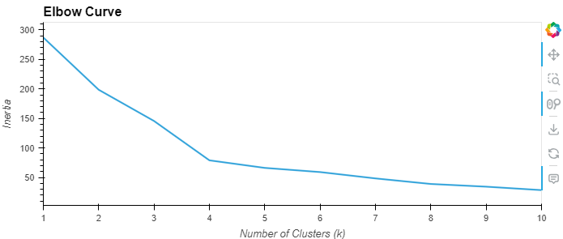
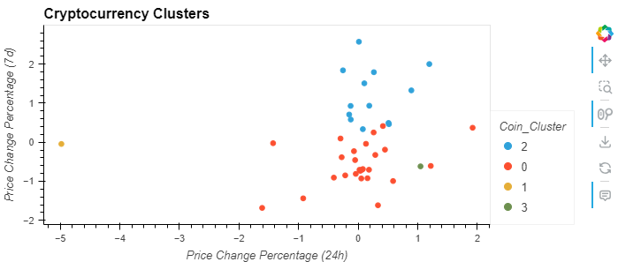
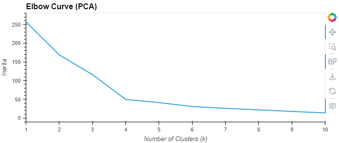
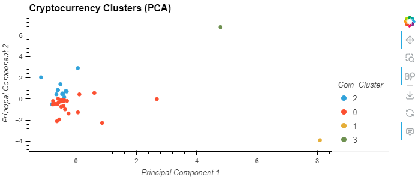

# Unsupervised Learning Assignment
All the code for the application logic has been implemented in the [`Crypto_Clustering_starter_code.ipynb`](Crypto_Clustering_starter_code.ipynb) file.

## Elbow Curve

The best value for `k` is 4 - the elbow point where the inertia sharply decreases before leaving off.

## Scatter Plot for Cryptocurrency Clusters

## Elbow Curve (with PCA)

The best value for `k` when using the PCA data is 4. It doesn't differ from the best `k` value found using the original data.
It seems that reducing dimensions via PCA hasn’t significantly altered the natural groupings in your data. The dominant patterns remain, meaning PCA preserved the most meaningful variance while filtering out noise.

## Scatter Plot for Cryptocurrency Clusters (with PCA)

Reducing the number of features used in K-Means clustering can help create clearer clusters by eliminating unnecessary noise.
When too many features are included, they can introduce irrelevant variation, making it harder for the algorithm to distinguish patterns.
PCA helps by simplifying the dataset, keeping only the most important aspects and improving computational efficiency.
It speeds up clustering by reducing the number of dimensions, meaning fewer calculations and a smoother process.
However, one downside is that PCA removes some variance from the data, which can obscure natural groupings.
If too much information is lost, clusters may start overlapping, making them harder to define.
The key trade-off is finding the right balance—keeping enough variance to preserve meaningful differences while still reducing complexity.
In this case, PCA seems to improve cluster separation by focusing on the strongest relationships. While there is some overlap, the clusters appear more distinct compared to using all features.
The best approach is to test different numbers of principal components to see how much variance needs to be retained for optimal clustering.
